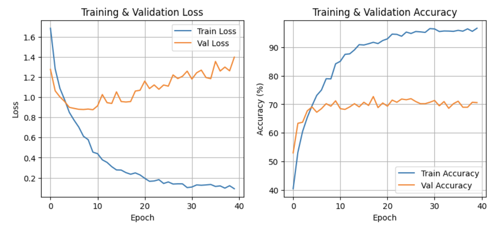
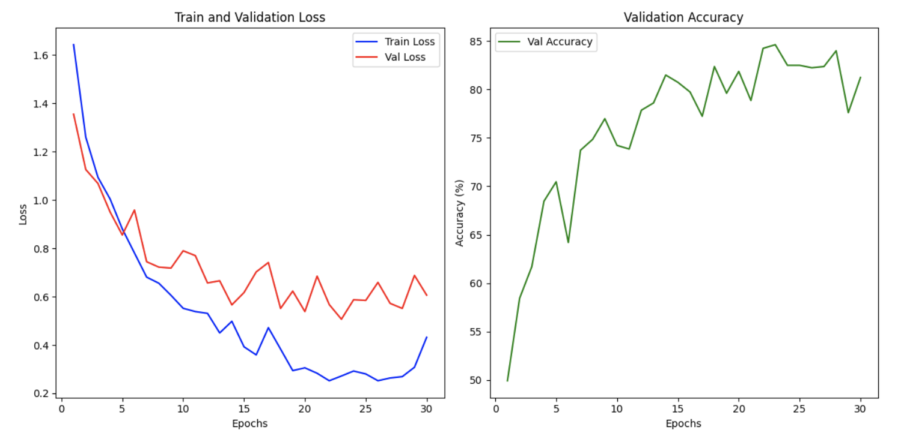
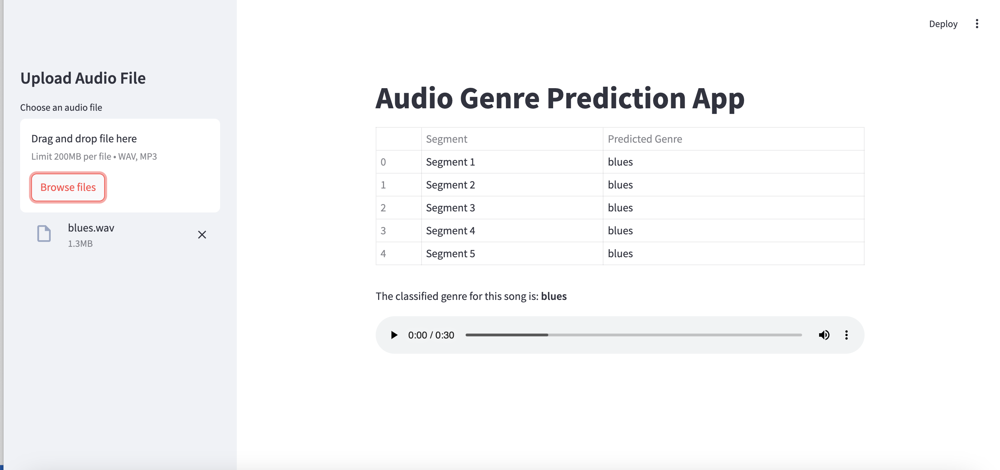

# 🎵 Music Genre Classification with Deep Learning

## 📄 Overview
This project uses deep learning to classify music genres based on audio files. A **Streamlit** app has been developed to predict genres in real-time, where users can upload audio files and receive predictions for each segment of the track.

The project is based on the **GTZAN music genre dataset** and includes models trained using **Convolutional Neural Networks (CNN)** and **Transformer models**.

## ✨ Features
- 🎧 **Real-time genre prediction** using a lightweight CNN model.
- 🎶 **Audio feature extraction** via **MFCC (Mel-Frequency Cepstral Coefficients)**.
- 💪 **Two model architectures**: 
  - CNN (2MB, optimized for fast inference).  
  - Transformer (~2GB, used for high-quality predictions).
- 🛠️ **Streamlit app** for easy interaction and inference.

## 🗂 Project Structure
```
├── app.py                  # Streamlit web app for genre prediction  
├── models/
│   ├── cnn_model.pth       # Trained CNN model (2MB)  
│   ├── GenreClassification.py  # CNN model architecture  
├── notebooks/
│   ├── music_classification.ipynb  # Jupyter notebook for training and evaluation  
└── requirements.txt        # Dependencies for running the project  
```

## 🎧 How the App Works
1. The uploaded audio file is split into **6-second segments**.
2. Each segment is classified separately using the CNN model.
3. The final prediction is determined by taking the **majority vote** of all segment classifications.

## 🔍 Model Details
- **CNN Model**: 
  - Lightweight (2MB), optimized for real-time inference in the Streamlit app.
  - Two convolutional layers, batch normalization, and max pooling.
- **Transformer Model**: 
  - Larger model (2GB) designed for high-quality predictions.
  - Processes entire audio clips for more robust classification.

## 📊 Training and Evaluation
- Below are the training and loss curves for the **CNN** and **Transformer** models:
  
  **CNN Training/Validation & Loss Curves:** **  
  **Transformer Training/Validation & Loss Curves:** **  

## 🛠️ Audio Preprocessing
1. All audio files are resampled to **22,050 Hz**.
2. Each track is divided into **5 segments**.
3. Feature Extraction (MFCC):
   - Number of MFCCs: 13  
   - FFT Window Size: 2048  
   - Hop Length: 512  
4. The extracted MFCC features and labels are stored in a **JSON dataset**.

## 🛠 How to Run the App
1. **Clone the repository**
   ```bash
   git clone https://github.com/bakalianosm/Music-Genre-Classification.git
   cd Music-Genre-Classification
   ```
2. **Install dependencies**
   ```bash
   pip install -r requirements.txt
   ```
3. **Run the Streamlit app**
   ```bash
   streamlit run app.py
   ```

## 🏁 Conclusion 

The **CNN model** (2MB) is optimized for real-time inference and achieves a validation accuracy of **~70%**, making it suitable for lightweight applications. On the other hand, the **Transformer model** (2GB) delivers higher accuracy (**~80%**) but requires significantly more computational resources. 

Overall, the CNN model is ideal for fast predictions in the Streamlit app, while the Transformer model is better suited for offline analysis where accuracy is the priority. 🎵✨

## 🎧 Example Prediction
Here’s an example of how the app predicts the genre of a song by analyzing its **6-second segments** and displaying the final result based on majority voting. 




Watch the demo of the app:
Click [here to watch the demo](./assets/demo.mov).
